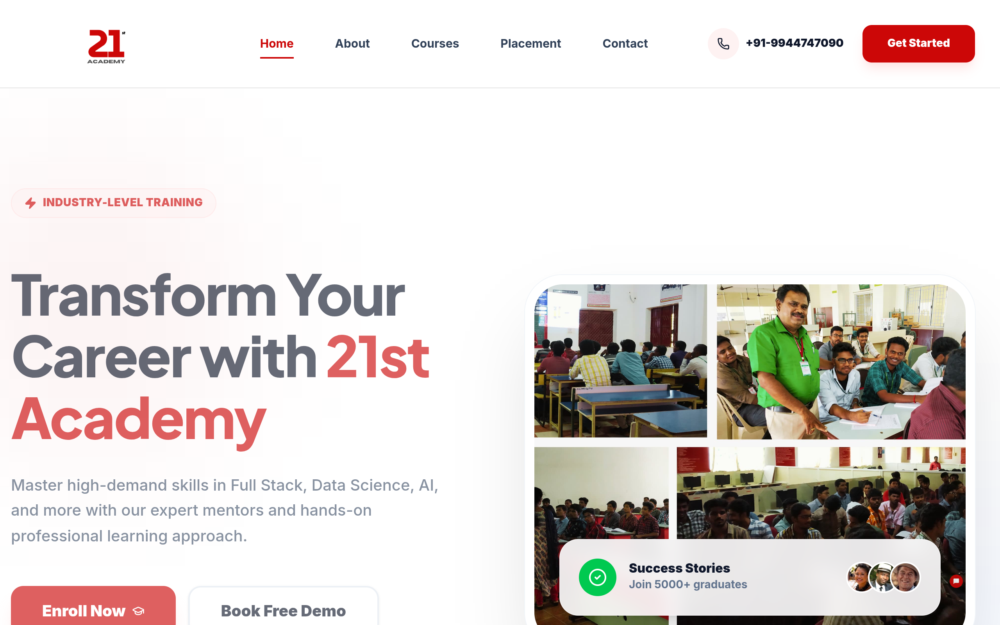

# 21stacademy DESIGN.md

> Auto-generated design system — reverse-engineered via static analysis by skillui.
> Frameworks: None detected
> Colors: 20 · Fonts: 3 · Components: 7
> Icon library: not detected · State: not detected
> Primary theme: dark · Dark mode toggle: yes · Motion: subtle

## Visual Reference

**Match this design exactly** — study colors, fonts, spacing, and component shapes before writing any UI code.



---

## 1. Visual Theme & Atmosphere

This is a **dark-themed** interface with a flat, warm visual language. Elevation is achieved through color and border shifts rather than shadows — a clean, industrial aesthetic. Typography pairs **Inter** for display/headings with **Plus Jakarta Sans** for body text, creating clear visual hierarchy through type contrast. Spacing follows a **4px base grid** (compact density), with scale: 4, 8, 16, 128px. The accent color **#f05100** anchors interactive elements (buttons, links, focus rings). Motion is subtle — smooth transitions (150-300ms) ease state changes without drawing attention.

---

## 2. Color Palette & Roles

| Token | Hex | Role | Use |
|---|---|---|---|
| color-slate-900 | `#0f172b` | background | Page background, darkest surface |
| color-black | `#000000` | surface | Card and panel backgrounds |
| tw-ring-offset-color | `#ffffff` | text-primary | Headings and body text |
| color-slate-400 | `#90a1b9` | text-muted | Captions, placeholders, secondary info |
| color-orange-600 | `#f05100` | accent | CTAs, links, focus rings, active states |
| color-red-600 | `#cc0707` | danger | Error states, destructive actions |
| color-green-50 | `#f0fdf4` | success | Success states, positive indicators |
| color-amber-500 | `#f99c00` | warning | Warning states, caution indicators |
| color-blue-600 | `#155dfc` | info | Informational highlights |
| color-red-50 | `#fef2f2` | unknown | Palette color |
| foreground | `#0a0a0a` | unknown | Palette color |
| color-red-500 | `#ea1515` | unknown | Palette color |
| color-blue-100 | `#dbeafe` | unknown | Palette color |
| color-indigo-50 | `#eef2ff` | unknown | Palette color |
| color-purple-600 | `#9810fa` | unknown | Palette color |
| color-slate-200 | `#e2e8f0` | unknown | Palette color |
| color-slate-800 | `#1d293d` | unknown | Palette color |
| color-red-700 | `#bf000f` | unknown | Palette color |
| color-orange-100 | `#ffedd5` | unknown | Palette color |
| color-amber-400 | `#fcbb00` | unknown | Palette color |

### Dark Mode Token Mapping

| Variable | Light | Dark |
|---|---|---|
| `--background` | `0 0% 100%` | `0 0% 3.9%` |
| `--foreground` | `0 0% 3.9%` | `0 0% 98%` |
| `--border` | `0 0% 89.8%` | `0 0% 14.9%` |
| `--input` | `0 0% 89.8%` | `0 0% 14.9%` |
| `--ring` | `0 92% 41%` | `0 72% 51%` |

### CSS Variable Tokens

```css
--tw-border-spacing-x: 0;
--tw-border-spacing-y: 0;
--tw-border-style: solid;
--color-background: hsl(var(--background));
--color-foreground: hsl(var(--foreground));
--color-card: hsl(var(--card));
--color-card-foreground: hsl(var(--card-foreground));
--color-primary: hsl(var(--primary));
--color-primary-foreground: hsl(var(--primary-foreground));
--color-secondary: hsl(var(--secondary));
--color-secondary-foreground: hsl(var(--secondary-foreground));
--color-muted-foreground: hsl(var(--muted-foreground));
--color-accent: hsl(var(--accent));
--color-accent-foreground: hsl(var(--accent-foreground));
--color-destructive: hsl(var(--destructive));
--color-destructive-foreground: hsl(var(--destructive-foreground));
--color-border: hsl(var(--border));
--tw-border-spacing-y: calc(var(--spacing)*4);
--tw-border-style: dashed;
--tw-border-style: none;
```


---

## 3. Typography Rules

**Font Stack:**
- **Plus Jakarta Sans** — Heading 1, Heading 2
- **Inter** — Body, Caption
- **SFMono-Regular** — Code

**Font Sources:**

```css
@font-face {
  font-family: "Inter";
  src: url("fonts/Inter-Bold.ttf") format("truetype");
  font-weight: 700;
}
@font-face {
  font-family: "Inter";
  src: url("fonts/Inter-Regular.ttf") format("truetype");
  font-weight: 400;
}
@font-face {
  font-family: "Plus Jakarta Sans";
  src: url("fonts/PlusJakartaSans-Bold.ttf") format("truetype");
  font-weight: 700;
}
@font-face {
  font-family: "Plus Jakarta Sans";
  src: url("fonts/PlusJakartaSans-Regular.ttf") format("truetype");
  font-weight: 400;
}
```

| Role | Font | Size | Weight |
|---|---|---|---|
| Heading 1 | Plus Jakarta Sans | 180px | 700 |
| Heading 2 | Plus Jakarta Sans | 120px | 700 |
| Body | Inter | 15px | 400 |
| Caption | Inter | 13px | 400 |
| Code | SFMono-Regular | 14px | 400 |

**Typographic Rules:**
- Limit to 3 font families max per screen
- Use **Plus Jakarta Sans** for body/UI text, **Inter** for display/headings
- Maintain consistent hierarchy: no more than 3-4 font sizes per screen
- Headings use bold (600-700), body uses regular (400)
- Line height: 1.5 for body text, 1.2 for headings
- Use color and opacity for secondary hierarchy, not additional font sizes


---

## 4. Component Stylings

### Layout (1)

**Footer** — `html`

### Navigation (1)

**Navigation** — `html`

### Data Input (2)

**Button** — `html`
- Animation: 

**Input** — `html`
- State: :focus, :placeholder

### Media (3)

**Image** — `html`

**Icon** — `html`

**Map/Canvas** — `html`


---

## 5. Layout Principles

- **Base spacing unit:** 4px
- **Spacing scale:** 4, 8, 16, 128
- **Border radius:** 1.25rem, 1.5rem, 2rem, 2.5rem, 3rem, 3.5rem, 4rem
- **Max content width:** 1400px

**Spacing as Meaning:**
| Spacing | Use |
|---|---|
| 4-8px | Tight: related items within a group |
| 12-16px | Medium: between groups |
| 24-32px | Wide: between sections |
| 48px+ | Vast: major section breaks |


---

## 6. Depth & Elevation

No box-shadow values detected. The design uses a **flat visual style** — elevation is conveyed through background color shifts and borders rather than shadows.

**Elevation Strategy:**
| Level | Technique | Use |
|---|---|---|
| 0 — Base | Background color | Page background |
| 1 — Raised | Lighter surface + subtle border | Cards, panels |
| 2 — Floating | Even lighter surface + stronger border | Dropdowns, popovers |
| 3 — Overlay | Backdrop + modal surface | Modals, dialogs |

**Z-Index Scale:** `10, 20, 40, 50, 60, 100`


---

## 7. Animation & Motion

This project uses **subtle motion**. Transitions smooth state changes without demanding attention.

### CSS Animations

- `@keyframes spin`
- `@keyframes pulse`
- `@keyframes marquee`

### Animated Components

- **Button**: 

### Motion Guidelines

- Duration: 150-300ms for micro-interactions, 300-500ms for page transitions
- Easing: `ease-out` for enters, `ease-in` for exits
- Always respect `prefers-reduced-motion`


---

## 8. Do's and Don'ts

### Do's

- Use `#f05100` for interactive elements (buttons, links, focus rings)
- Use `#0f172b` as the primary page background
- Pair **Plus Jakarta Sans** (body) with **Inter** (display) — these are the only allowed fonts
- Follow the **4px** spacing grid for all margins, padding, and gaps
- Use border and background shifts for elevation — not shadows
- Use border-radius from the scale: 1.25rem, 1.5rem, 2rem, 2.5rem, 3rem
- Reuse existing components from Section 4 before creating new ones
- Always use CSS variables for colors — never hardcode hex
- Test both light and dark modes for contrast

### Don'ts

- Don't introduce colors outside this palette — extend the design tokens first
- Don't introduce additional font families beyond Plus Jakarta Sans and Inter and SFMono-Regular
- Don't use arbitrary spacing values — stick to multiples of 4px
- Don't add box-shadow — this design system uses flat elevation
- Don't use arbitrary border-radius values — pick from the defined scale
- Don't duplicate component patterns — check Section 4 first

### Anti-Patterns (detected from codebase)

- No box-shadow on any element
- No zebra striping on tables/lists


---

## 9. Responsive Behavior

| Name | Value | Source |
|---|---|---|
| sm | 40rem | css |
| md | 48rem | css |
| lg | 64rem | css |
| xl | 80rem | css |
| 2xl | 96rem | css |

**Approach:** Use `@media (min-width: ...)` queries matching the breakpoints above.


---

## 10. Agent Prompt Guide

Use these as starting points when building new UI:

### Build a Card

```
Background: #000000
Border: 1px solid var(--border)
Radius: 2.5rem
Padding: 16px
Font: Plus Jakarta Sans
No shadows — use borders and surface colors for depth.
```

### Build a Button

```
Primary: bg #f05100, text white
Ghost: bg transparent, border var(--border)
Padding: 8px 16px
Radius: 2.5rem
Hover: opacity 0.9 or lighter shade
Focus: ring with #f05100
```

### Build a Page Layout

```
Background: #0f172b
Max-width: 1400px, centered
Grid: 4px base
Responsive: mobile-first, breakpoints from Section 9
```

### Build a Stats Card

```
Surface: #000000
Label: #90a1b9 (muted, 12px, uppercase)
Value: #ffffff (primary, 24-32px, bold)
Status: use success/warning/danger from Section 2
```

### Build a Form

```
Input bg: #0f172b
Input border: 1px solid var(--border)
Focus: border-color #f05100
Label: #90a1b9 12px
Spacing: 16px between fields
Radius: 2.5rem
```

### General Component

```
1. Read DESIGN.md Sections 2-6 for tokens
2. Colors: only from palette
3. Font: Plus Jakarta Sans, type scale from Section 3
4. Spacing: 4px grid
5. Components: match patterns from Section 4
6. Elevation: flat, surface shifts
```
